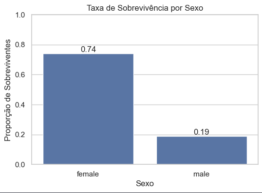
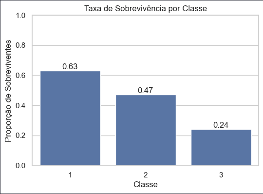
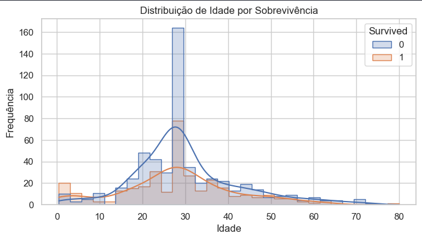
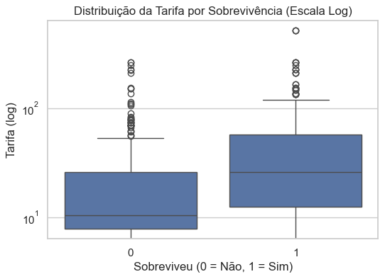
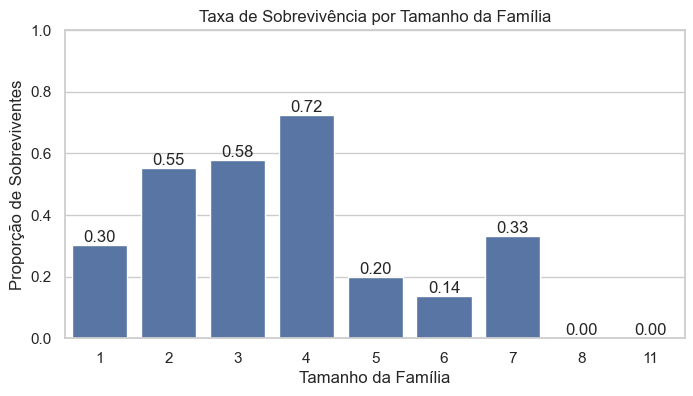

# Titanic Survival Analysis 🛳️

## 📌 Descrição do Projeto

Este projeto faz parte do **Data Science Journey**, com foco em desenvolver e demonstrar habilidades práticas de **Análise Exploratória de Dados (EDA)** utilizando um dataset clássico da área de dados: o **Titanic**.

O trabalho vai além de análises superficiais, buscando **validar hipóteses**, **identificar padrões**, **cruzar variáveis relevantes** e construir interpretações analíticas claras, no padrão esperado para projetos de portfólio profissional.

---

## 🎯 Objetivo

Analisar os fatores que influenciaram a sobrevivência dos passageiros do Titanic, respondendo perguntas como:

* O sexo influenciou a sobrevivência?
* A classe social teve impacto relevante?
* A idade foi determinante?
* Tarifas mais altas aumentaram as chances de sobrevivência?
* O tamanho da família alterou o desfecho?
* A combinação entre fatores sociais amplificou ou reduziu a sobrevivência?

---

## 🧪 Metodologia

O projeto seguiu um fluxo estruturado de análise:

1. **Exploração inicial dos dados**
2. **Limpeza e tratamento de valores ausentes**
3. **Engenharia de variáveis**

   * Criação de `FamilySize`
   * Criação de faixas etárias (`AgeGroup`)
   * Criação de faixas de tarifa (`FareGroup`)
4. **Análise Exploratória de Dados (EDA)**

   * Estatísticas descritivas
   * Visualizações gráficas
5. **Validação de hipóteses**
6. **Síntese analítica final**

---

## 📊 Principais Análises e Insights

### 1️⃣ Sobrevivência por Sexo



**Insight:**
Passageiros do sexo feminino apresentaram taxas de sobrevivência significativamente superiores às dos homens, independentemente da classe social.

---

### 2️⃣ Sobrevivência por Classe Social (Pclass)



**Insight:**
Observou-se um gradiente claro de sobrevivência decrescente da 1ª para a 3ª classe, evidenciando a forte influência da posição socioeconômica.

---

### 3️⃣ Sobrevivência por Faixa Etária



**Insight:**
Crianças apresentaram as maiores taxas de sobrevivência. A idade influenciou o desfecho, mas de forma não linear, com adultos jovens tendo taxas inferiores às de adultos.

---

### 4️⃣ Sobrevivência por Faixa de Tarifa



**Insight:**
Passageiros que pagaram tarifas mais altas apresentaram maior probabilidade de sobrevivência, reforçando o papel do fator socioeconômico.

---

### 5️⃣ Análise Combinada — Classe × Tamanho da Família



**Insight:**
Famílias pequenas (2 a 4 pessoas) tiveram melhores taxas de sobrevivência, especialmente nas classes mais altas. Em famílias grandes, a sobrevivência caiu drasticamente, sobretudo na 3ª classe.

---

## 🧠 Síntese das Hipóteses

| Hipótese                                            | Resultado                  |
| --------------------------------------------------- | -------------------------- |
| Mulheres tiveram maior sobrevivência                | ✅ Confirmada               |
| 1ª classe teve maior sobrevivência                  | ✅ Confirmada               |
| Passageiros mais jovens sobreviveram mais           | ⚠️ Parcialmente confirmada |
| Tarifas mais altas aumentam sobrevivência           | ✅ Confirmada               |
| Tamanho da família influencia sobrevivência         | ⚠️ Parcialmente confirmada |
| Fatores sociais combinados amplificam sobrevivência | ✅ Confirmada               |

---

## 🛠️ Tecnologias Utilizadas

* Python
* Pandas
* NumPy
* Matplotlib
* Seaborn
* Jupyter Notebook
* Git & GitHub

---

## 📁 Estrutura do Repositório

```
├── data/
│   └── titanic.csv
├── imagens/
│   ├── image.png
│   ├── image-1.png
│   ├── image-2.png
│   ├── image-3.png
│   └── image-4.png
├── titanic_eda.ipynb    
├── diario_estudos.md
└── README.md
```

---

## 🚀 Próximos Passos

* Feature Engineering adicional
* Modelagem preditiva (Machine Learning)
* Avaliação de métricas
* Comparação entre modelos

---

📌 *Projeto desenvolvido como parte de uma jornada estruturada de aprendizado em Ciência de Dados, com foco em análise, interpretação e comunicação de resultados.*
